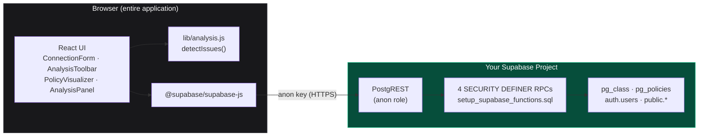
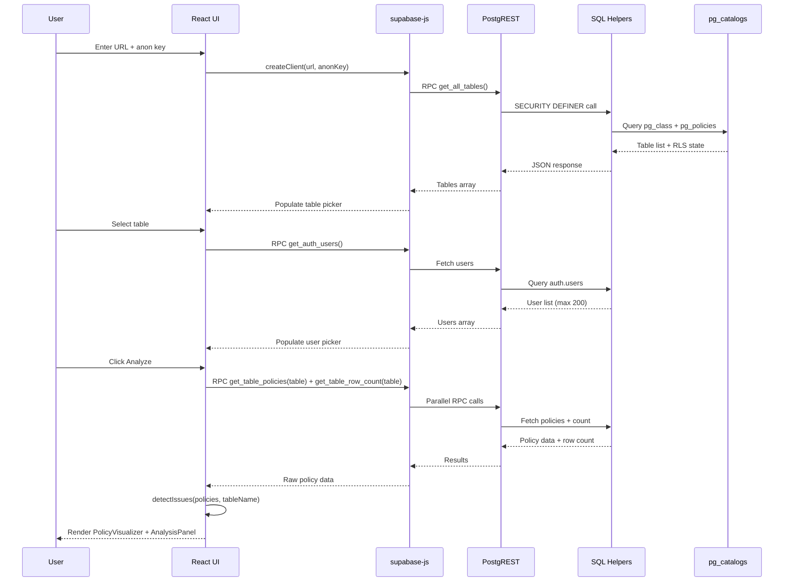
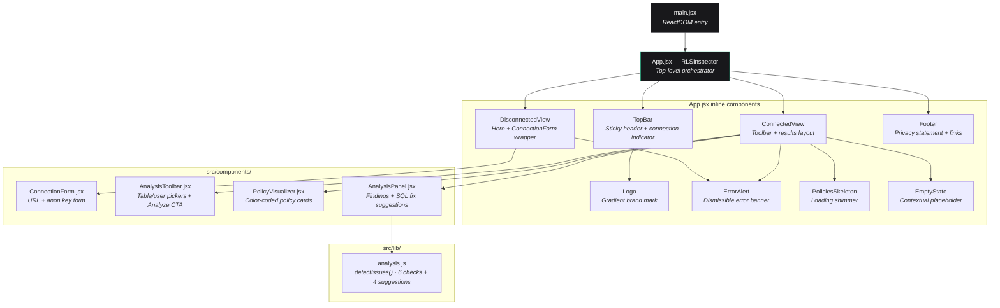
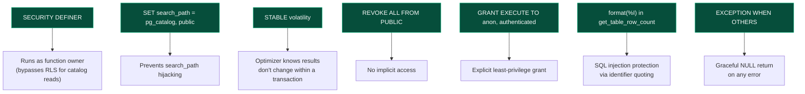
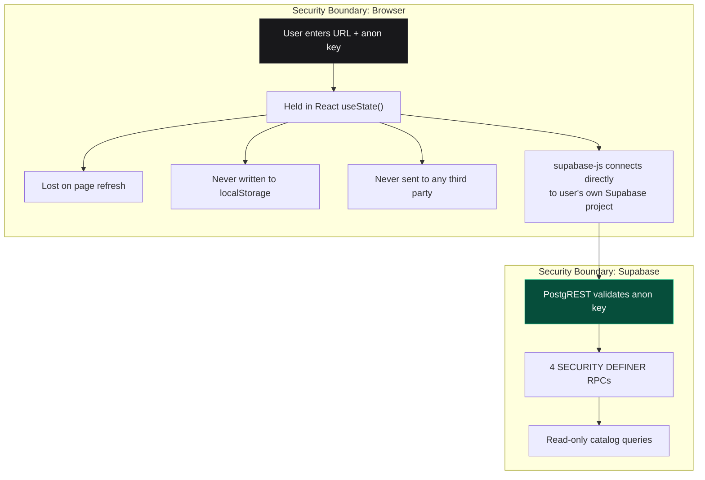

<p align="center">
  
  
  
  
  
  
  
</p>

<h1 align="center">RLS Inspector</h1>

<p align="center">
  <strong>Visual debugger for Supabase Row Level Security policies.</strong><br/>
  List every policy on a table. Surface missing <code>WITH CHECK</code> clauses, overly-permissive rules, and common security mistakes. Get copy-pasteable SQL fixes.
</p>

<p align="center">
  <em>Client-side only — credentials never leave your browser. Zero backend. Zero telemetry.</em>
</p>

---

## Why This Exists

Three pain points this tool addresses:

| # | Problem | What happens |
|---|---------|-------------|
| 1 | **`permission denied for table foo`** | The most common Supabase error log line — tells you nothing about *which* of N policies rejected the query, or why. |
| 2 | **SQL Editor bypasses RLS** | Queries that work in the Supabase dashboard editor silently fail in production because the editor runs as the `postgres` role. |
| 3 | **AI-generated policies are subtly wrong** | Policies from Lovable, Bolt.new, or Cursor's `@supabase` integration often ship with missing `WITH CHECK`, `USING (true)`, or forgotten role grants — failures surface days later as opaque "permission denied." |

RLS Inspector reads policy metadata directly from `pg_policies`, normalizes it, and surfaces the issues a human reviewer would catch — in seconds, not hours.

---

## Preview

```
┌──────────────────────────────────────────────────────────────────────────┐
│ RLS Inspector · Supabase debugger                  ● nwkxop…supabase.co │
├──────────────────────────────────────────────────────────────────────────┤
│  [Table: posts — 3 policies] · [Test as: alice@…] · [Analyze]           │
│                                                                         │
│  posts                         3 POLICIES · 0 ROWS · 1 SELECT 1 INSERT │
│  ────────────────────────────────────────────────────────────────────── │
│  │ INSERT · Users can insert their own posts                 permissive │
│  │   WITH CHECK   (auth.uid() = user_id)                                │
│                                                                         │
│  │ SELECT · Users can view their own posts                   permissive │
│  │   USING        (auth.uid() = user_id)                                │
│                                                                         │
│  │ UPDATE · Anyone can update                 ▲ overly permissive       │
│  │   USING        true                                      unrestricted│
│  │   WITH CHECK   — not set —                                           │
│                                                                         │
│  Findings                                         1 critical · 1 warning│
│  ▌ Critical · UPDATE policy missing WITH CHECK                          │
│  Suggested fix:  ALTER POLICY "Anyone can update" ON "posts"            │
│                  WITH CHECK (auth.uid() = user_id);         [Copy SQL]  │
└──────────────────────────────────────────────────────────────────────────┘
```

---

## Features

### Static Analysis Engine

The analysis engine (`lib/analysis.js`) runs six deterministic checks against every policy and always emits four best-practice suggestions:

| # | Check | Severity | Trigger condition | Why it matters |
|---|-------|----------|-------------------|----------------|
| 1 | Missing `WITH CHECK` | **Critical** | `INSERT` or `UPDATE` policy has no `with_check` clause | Users can write rows that violate the policy's intended invariant — the most common Supabase RLS bug. |
| 2 | Overly permissive | Warning | `USING` clause is literally `true` or `TRUE` | Allows the operation for everyone. Almost always a mistake outside of a deliberately public table. |
| 3 | Missing `SELECT` coverage | Warning | Table has `INSERT`/`UPDATE` policies but no `SELECT` policy | Users can write data they can't read back — surfaces as "data disappeared after save" bugs. |
| 4 | Complex conditions | Warning | `USING` clause contains `function`, `array`, or `json` keywords | May skip indexes; flag for `EXPLAIN` review on large tables. |
| 5 | `auth.role()` usage | Warning | `USING` clause references `auth.role()` | Reminder to ensure the role column is indexed for performance. |
| 6 | Missing auth context | Warning | Non-`SELECT` policy doesn't reference `auth.uid()`, `auth.role()`, `auth.email()`, `current_user`, or `session_user` — and `USING` is not `true` | Policy can't differentiate between users — allows or denies uniformly. |

**Best-practice suggestions** (always emitted):

| Suggestion | Description |
|------------|-------------|
| Test with different user roles | Policies behave differently based on each user's auth context and role. |
| Monitor policy rejections | Enable PostgreSQL logging to see which policies are rejecting queries in production. |
| Document your policies | Add comments to RLS policies explaining the business logic. |
| Regular security audit | Review RLS policies quarterly as your app grows. |

Each critical finding includes a **copy-pasteable `ALTER POLICY`** statement with correctly quoted Postgres identifiers (via `format(%I)`-style quoting) and a sensible `WITH CHECK` template.

### Policy Visualization

Policies are rendered as color-coded cards with a left-edge stripe per operation type:

| Command | Color | Icon |
|---------|-------|------|
| `SELECT` | Blue | Eye |
| `INSERT` | Emerald | Plus |
| `UPDATE` | Amber | Pencil |
| `DELETE` | Red | Trash |
| `ALL` | Violet | Database |

Each card displays the policy name, permissive/restrictive badge, applied roles, `USING` clause, `WITH CHECK` clause (or a "not set" warning), and inline severity badges for detected issues.

### Additional Features

- **Graceful helper detection** — if a SQL helper function is missing, the UI shows a clear "run `setup_supabase_functions.sql`" message instead of a cryptic PostgREST error (detects Postgres error code `42883`)
- **Fallback users** — when `get_auth_users` RPC fails, two placeholder users are injected so analysis can still proceed
- **Keyboard shortcut** — `Cmd/Ctrl + K` focuses the table selector
- **Clipboard copy** — suggested SQL fixes have a one-click Copy button
- **Loading skeletons** — shimmer animations during data fetch
- **Dark mode only** — designed for developer-tool use (color-scheme: dark, `#09090b` background)

---

## Architecture

### System Overview



> **Key architectural property:** There is no backend service. The browser connects directly to the user's Supabase project. Credentials are held in React state — never persisted to `localStorage`, cookies, or any server.

### Data Flow



### Component Architecture



---

## Project Structure

```
.
├── index.html                          # Vite HTML entry — Inter + JetBrains Mono via Google Fonts
├── package.json                        # 4 runtime deps, 5 dev deps, ES modules
├── vite.config.js                      # React plugin, port 5173, auto-open
├── tailwind.config.js                  # Inter / JetBrains Mono / 6-step type scale
├── postcss.config.js                   # tailwindcss + autoprefixer
├── setup_supabase_functions.sql        # Server-side contract: 4 idempotent RPCs
├── LICENSE                             # MIT
└── src/
    ├── main.jsx                        # ReactDOM.createRoot entry point
    ├── index.css                       # Tailwind layers + scrollbar + animations
    ├── App.jsx                         # Orchestrator (state, data fetching, layout)
    │                                   #   inline: TopBar, Logo, DisconnectedView,
    │                                   #   ConnectedView, ErrorAlert, PoliciesSkeleton,
    │                                   #   EmptyState, Footer
    ├── components/
    │   ├── ConnectionForm.jsx          # URL + anon key card with validation
    │   ├── AnalysisToolbar.jsx         # Table picker, user picker, Analyze button
    │   │                               #   inline: Picker
    │   ├── PolicyVisualizer.jsx        # Policy cards with color-coded stripes
    │   │                               #   inline: Stat, PolicyCard, CodeBlock, Badge
    │   └── AnalysisPanel.jsx           # Findings panel with copy-pasteable SQL fixes
    │                                   #   inline: Pill, Finding, SuggestedFix
    └── lib/
        └── analysis.js                 # detectIssues() — 6 rules, 4 suggestions
                                        #   also exports: testPolicyCondition(),
                                        #   extractColumnsFromCondition() (unused — future)
```

> **Design philosophy:** Components are deliberately flat — no hooks library, no state manager, no router. The entire app lives in `App.jsx`'s `useState` calls. Sub-components that only serve one parent are defined inline in the same file.

---

## Tech Stack

| Layer | Choice | Version | Rationale |
|-------|--------|---------|-----------|
| Framework | React | ^18.2.0 | Fast HMR, zero config, no SSR needed for a single-page tool. |
| Bundler | Vite | ^5.0.8 | Instant dev server, optimized builds, native ESM. |
| Styling | Tailwind CSS | ^3.4.1 | Tokens-as-classes; no parallel design-system file to drift. |
| Icons | lucide-react | ^0.292.0 | Consistent 24×24 stroke icons; replaces all emoji iconography. |
| Fonts | Inter (UI) + JetBrains Mono (code) | Google Fonts CDN | The canonical two-font dev-tool pairing. Inter uses OpenType features `cv02`, `cv03`, `cv04`, `cv11`. |
| Data | @supabase/supabase-js | ^2.38.4 | Single dependency for all Supabase RPC calls. No auth flow needed — uses anon key only. |
| PostCSS | postcss + autoprefixer | ^8.4.31 / ^10.4.16 | Required by Tailwind CSS processing pipeline. |

**Total dependencies:** 4 runtime, 5 dev. No state library, no UI kit, no animation library, no router.

---

## SQL Helpers Contract

The `anon` role cannot read `pg_policies`, `pg_class`, or `auth.users` through PostgREST by default. RLS Inspector ships [`setup_supabase_functions.sql`](./setup_supabase_functions.sql) — a single idempotent SQL file that installs four `SECURITY DEFINER` functions:

| Function | Returns | Purpose |
|----------|---------|---------|
| `get_all_tables()` | `(name TEXT, rls_enabled BOOLEAN, policy_count BIGINT)` | Lists all tables in `public` schema with RLS state. Populates the table picker. |
| `get_table_policies(table_name TEXT)` | `(policyname TEXT, cmd TEXT, qual TEXT, with_check TEXT, roles TEXT[], permissive TEXT)` | Returns every RLS policy on a table. The core data source for the visualizer. |
| `get_auth_users(max_count INT DEFAULT 50)` | `(id UUID, email TEXT)` | Recent users from `auth.users`. Server-side cap at 200 rows. |
| `get_table_row_count(table_name TEXT)` | `BIGINT` | Total row count (RLS-bypassed). Used as the "X / Y rows" denominator. |

### SQL Security Patterns

Every function implements the following security hardening:



### Security Notice

> ⚠️ These functions are granted to the `anon` role. Anyone with your project URL + anon public key can:
>
> - List every table in the `public` schema and see whether RLS is enabled
> - Read the full text of every RLS policy
> - See up to 50 user IDs and email addresses from `auth.users`
> - Get the total row count (RLS-bypassed) of any public table
>
> **This is appropriate for dev/staging projects.** For production projects with real user data, change the `GRANT EXECUTE` from `anon` to `authenticated` and add a proper auth flow — or skip installing the helpers entirely.

### Uninstall

```sql
DROP FUNCTION IF EXISTS public.get_all_tables();
DROP FUNCTION IF EXISTS public.get_table_policies(TEXT);
DROP FUNCTION IF EXISTS public.get_auth_users(INT);
DROP FUNCTION IF EXISTS public.get_table_row_count(TEXT);
```

---

## Quickstart

### 1. Clone and install

```bash
git clone https://github.com/<your-username>/rls-inspector.git
cd rls-inspector
npm install
npm run dev
```

The dev server starts on `http://localhost:5173` and opens automatically.

### 2. Install SQL helpers in your Supabase project

1. Open the **SQL Editor** in your [Supabase dashboard](https://supabase.com/dashboard).
2. Paste the entire contents of [`setup_supabase_functions.sql`](./setup_supabase_functions.sql) and click **Run**. It's idempotent — safe to re-run.
3. Verify:
   ```sql
   SELECT * FROM public.get_all_tables() LIMIT 5;
   ```

### 3. Connect RLS Inspector

1. Go to **Settings → API** in the Supabase dashboard.
2. Copy the **Project URL** and the **anon (public)** key.
3. Paste both into the connection form at `http://localhost:5173`.
4. Click **Connect**.

### 4. Analyze

1. Select a table from the dropdown (shows RLS state and policy count).
2. Select a user from `auth.users` (or use the auto-generated placeholders).
3. Click **Analyze** to fetch policies and run all six static checks.

**Total setup time: ~5 minutes.**

---

## Development

```bash
npm run dev        # Vite dev server on :5173 with HMR, auto-open
npm run build      # Production bundle to dist/
npm run preview    # Serve production build on :4173
```

### Environment Variables

**None required.** Credentials are entered at runtime in the UI. No `.env` file is needed for development or production builds.

### Design System

The Tailwind configuration defines a custom 6-step type scale:

| Token | Size | Line Height | Weight | Use |
|-------|------|-------------|--------|-----|
| `display` | 28px | 34px | 700 | Page title |
| `h2` | 18px | 24px | 600 | Section headings |
| `h3` | 14px | 20px | 600 | Card titles |
| `body` | 14px | 20px | — | Default text |
| `small` | 13px | 18px | — | Secondary text |
| `micro` | 11px | 14px | 600 | Labels, badges |

---

## Deployment

RLS Inspector is a static SPA. No server-side runtime required.

### Vercel (recommended)

```bash
npm install -g vercel
vercel --prod
```

Or use `npm run deploy` which calls `vercel` directly.

### Any static host

| Setting | Value |
|---------|-------|
| Build command | `npm run build` |
| Output directory | `dist/` |
| Environment variables | None |

Works with **Netlify**, **Cloudflare Pages**, **GitHub Pages**, **Render**, or any static file server.

> **Note:** No `vercel.json` or routing configuration is needed — the app has no client-side routing. It's a single `index.html` entry point.

---

## Security Model



**Security properties of this design:**

| Property | Implementation |
|----------|---------------|
| No backend | All processing happens in the browser |
| No credential storage | URL + anon key live in React state, lost on refresh |
| No telemetry | Zero analytics, zero tracking, zero external calls |
| No write operations | All four SQL helpers are read-only |
| Injection-safe | `get_table_row_count` uses `format(%I)` for identifier quoting |
| Scoped access | RPCs only read `public` schema metadata + bounded `auth.users` |
| Idempotent install | SQL file uses `CREATE OR REPLACE`, safe to re-run |
| Clean uninstall | Commented `DROP` block at bottom of SQL file |

**Known limitations (security-relevant):**

- URL validation only accepts `*.supabase.co` domains — self-hosted Supabase instances or custom domains are currently rejected by the client-side regex
- No Content Security Policy headers are configured
- No rate limiting on RPC calls from the client
- No React Error Boundary — unhandled exceptions will white-screen the app

---

## Engineering Decisions

### Why no state management library?

The entire app state lives in `App.jsx` via 11 `useState` calls. The state graph is a simple linear pipeline: connect → select table → select user → analyze → display results. There are no cross-cutting state concerns, no shared state between sibling components, and no state that needs to survive navigation. Adding Redux, Zustand, or Jotai would increase bundle size and complexity for zero benefit.

### Why no router?

RLS Inspector is a single-screen tool. The "disconnected" and "connected" states are conditional renders within the same component, not separate routes. A router would add a dependency, require URL synchronization logic, and introduce edge cases around deep-linking to connection states that shouldn't be bookmarkable (since credentials aren't persisted).

### Why `SECURITY DEFINER` instead of `SECURITY INVOKER`?

PostgREST connections use the `anon` role, which has no access to `pg_class`, `pg_policies`, or `auth.users`. `SECURITY DEFINER` executes the function as its owner (typically `postgres`), bypassing these restrictions. The trade-off is that the functions have elevated privileges — mitigated by making them read-only, setting `search_path` explicitly, and scoping grants to `anon` + `authenticated`.

### Why static analysis instead of runtime evaluation?

With only the `anon` key, the tool cannot mint a JWT for a specific `auth.uid()` and execute policies as that user. True impersonation would require the project's JWT secret. The "Test as user X" picker informs the structural analysis context but does not actually evaluate `(auth.uid() = user_id)` at runtime. This is a deliberate design constraint — the tool is useful without requiring secret key access.

### Why 4 runtime dependencies?

| Decision | Rejected alternative | Reason |
|----------|---------------------|--------|
| React only (no meta-framework) | Next.js, Remix | No SSR, no routing, no API routes needed. A meta-framework would be pure overhead. |
| Tailwind only (no UI kit) | shadcn/ui, Radix | The app has ~12 unique UI elements. A component library would add deps without saving meaningful development time. |
| lucide-react (no emoji) | Emoji icons, Heroicons | Consistent stroke weight across all icons. Emoji render differently per OS. |
| supabase-js (no raw fetch) | fetch + manual JWT | supabase-js handles PostgREST RPC calling conventions, error normalization, and retry logic. |

---

## Known Limitations

Stated explicitly because honesty builds trust:

| Limitation | Impact | Workaround |
|------------|--------|------------|
| **Cannot impersonate users** | "Test as user X" is structural only — does not evaluate `auth.uid()` at runtime | Requires JWT secret for true impersonation (see Roadmap) |
| **No `EXPLAIN` analysis** | Performance findings are pattern-based (keywords in `USING` clause), not query-plan-driven | Run `EXPLAIN ANALYZE` manually in the SQL Editor |
| **No role grant checking** | A policy naming an ungranted role will appear "fine" structurally | Check `pg_roles` manually |
| **`public` schema only** | Internal schemas and non-public tables are excluded | Modify `get_all_tables()` to support other schemas |
| **`*.supabase.co` URLs only** | Self-hosted Supabase or custom domains are rejected by client-side validation | Modify the regex in `ConnectionForm.jsx` |
| **No tests** | Zero test files in the repository | See Roadmap |
| **No CI/CD** | No GitHub Actions, no automated build verification | See Roadmap |
| **`testPolicyCondition()` and `extractColumnsFromCondition()`** | Exported from `analysis.js` but never imported — scaffolding for future runtime analysis | Not yet integrated |

---

## Roadmap

| Idea | Shape | Complexity |
|------|-------|------------|
| **Real user impersonation** | Sign a JWT with the project's JWT secret (entered once, never stored) and run a `SELECT` to see actual rows the user can read | High |
| **`EXPLAIN ANALYZE` integration** | Surface the query plan and flag sequential scans on large tables | Medium |
| **Snapshot diffing** | Paste yesterday's `pg_dump --schema-only` and today's; flag every policy that changed | Medium |
| **Markdown audit export** | One-click "policy audit report" for SOC-2 / HIPAA paperwork | Low |
| **Multi-schema support** | Drop the `WHERE schemaname = 'public'` constraint, add a schema picker | Low |
| **Test suite** | Unit tests for `analysis.js`, integration tests for the RPC flow | Medium |
| **CI/CD pipeline** | GitHub Actions for lint, build, and deploy verification | Low |
| **Self-hosted Supabase support** | Relax URL validation regex to accept custom domains | Low |

PRs welcome on any of these.

---

## Contributing

Contributions welcome, especially on the roadmap items above.

### Ground rules

1. **No new dependencies without a paragraph of justification in the PR description.** The 9-dependency total is small on purpose.
2. **No emoji icons in the UI.** Lucide already covers every icon the tool needs. Emoji are fine in commit messages and PR descriptions.

### PR flow

```bash
git checkout -b feat/your-feature
# ... edits ...
npm run build              # must pass
git commit -m "feat: ..."
git push -u origin feat/your-feature
# Open a pull request
```

### Code style

No ESLint or Prettier configs are included. The codebase uses consistent conventions: functional components, `useCallback` for stable references, `useEffect` for side effects, Tailwind for all styling. Match the existing patterns.

---

## License

[MIT](./LICENSE) — do whatever you want with it.

Copyright © 2026 Habin.

---

## Credits

Built in response to one too many `permission denied for table foo` log lines. Design inspired by the density of [Vercel's](https://vercel.com) deploy logs and the sobriety of [Linear's](https://linear.app) issue views — dense, sober, single-purpose.
