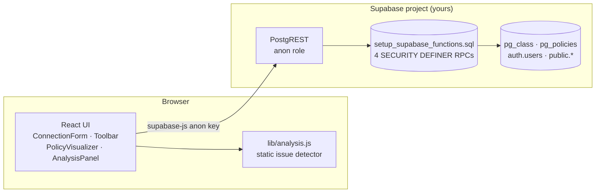

# RLS Inspector

**A visual debugger for Supabase Row Level Security policies.**
Lists every policy on a table, surfaces the structural mistakes that produce silent "permission denied" failures, and offers copy-pasteable SQL fixes.

<p>
  <a href="#quickstart"></a>
  <a href="#tech-stack"></a>
  <a href="#the-sql-helpers-contract"></a>
  <a href="#license"></a>
</p>

> Connect with your Supabase **anon** key, pick a table, pick a user, and get a list of every RLS policy with its `USING` and `WITH CHECK` clauses, plus a static analysis pass that catches the most common security and integrity mistakes.

---

## Why this exists

Three pain points the tool addresses, in roughly the order developers hit them:

1. **`permission denied for table foo`** is the most common Supabase error log line, and it tells you nothing about *which* of N policies rejected the query, or why.
2. **The SQL Editor bypasses RLS.** A query that works in the dashboard's editor will silently fail in production for actual users, because the editor runs as the `postgres` role.
3. **Policies generated by AI tooling** (Lovable, Bolt.new, Cursor's `@supabase` integration) are often subtly wrong — a missing `WITH CHECK`, a `USING (true)`, a forgotten role grant — and the failure mode is the same opaque "permission denied" days later.

This tool reads policy metadata directly from `pg_policies`, normalizes it, and surfaces the issues a human reviewer would catch.

---

## Preview

> Drop a screenshot at `docs/preview.png` to have it render here.

```
┌──────────────────────────────────────────────────────────────────────────┐
│ RLS Inspector · Supabase debugger                  ● nwkxop…supabase.co │
├──────────────────────────────────────────────────────────────────────────┤
│  [Table: posts — 3 policies] · [Test as: alice@…] · [Analyze]            │
│                                                                          │
│  posts                          3 POLICIES · 0 ROWS · 1 SELECT 1 INSERT  │
│  ─────────────────────────────────────────────────────────────────────   │
│  │ INSERT · Users can insert their own posts                  permissive │
│  │   WITH CHECK   (auth.uid() = user_id)                                 │
│                                                                          │
│  │ SELECT · Users can view their own posts                    permissive │
│  │   USING        (auth.uid() = user_id)                                 │
│                                                                          │
│  │ UPDATE · Anyone can update                  ▲ overly permissive       │
│  │   USING        true                                       unrestricted│
│  │   WITH CHECK   — not set —                                            │
│                                                                          │
│  Findings                                          1 critical · 1 warning│
│  ▌ Critical · UPDATE policy missing WITH CHECK                           │
│  Suggested fix:  ALTER POLICY "Anyone can update" ON "posts"             │
│                  WITH CHECK (auth.uid() = user_id);          [Copy SQL]  │
└──────────────────────────────────────────────────────────────────────────┘
```

---

## What it catches

| Severity | Rule | Why it matters |
|---|---|---|
| Critical | `INSERT`/`UPDATE` policy without a `WITH CHECK` clause | Users can write rows that don't satisfy the policy's intended invariant — the most common Supabase RLS bug. |
| Warning  | Policy with `USING (true)` | Allows the operation for everyone with the granted role. Almost always a mistake outside of a deliberately public table. |
| Warning  | Policy missing references to `auth.uid() / auth.role() / auth.email()` (on non-`SELECT`) | The policy can't differentiate users — it allows or denies for everyone uniformly. |
| Warning  | Tables that have `INSERT`/`UPDATE` policies but no `SELECT` policy | Users can write rows they can't read back, which surfaces as confusing "data disappeared after save" bugs. |
| Warning  | Conditions referencing JSON / array operators / functions | Often skips indexes; flag for an `EXPLAIN` review on large tables. |
| Suggestion | Test with multiple roles, document policies, schedule audits | Best-practice nudges, not red flags. |

Each critical finding ships with a **copy-pasteable** `ALTER POLICY` statement that uses correctly quoted identifiers and a sensible `WITH CHECK` template.

---

## Quickstart

```bash
git clone https://github.com/<your-username>/rls-inspector.git
cd rls-inspector
npm install
npm run dev
```

Then in Supabase:

1. Open the **SQL Editor** in your Supabase dashboard.
2. Paste the entire contents of [`setup_supabase_functions.sql`](./setup_supabase_functions.sql) and run it. Idempotent — safe to re-run.
3. **Settings → API** — copy the **Project URL** and the **anon (public)** key.
4. Paste both into `http://localhost:5173/`, click **Connect**.

That's the full setup loop. Total time: about 5 minutes.

> See [`DEPLOYMENT_GUIDE.md`](./DEPLOYMENT_GUIDE.md) for the full walkthrough including a sample `posts` table you can seed to see the analyzer fire on a real-but-fixable bug.

---

## How it works



The browser is the only application surface. The Inspector calls four helper RPCs in your Supabase project, runs `lib/analysis.js` over the response, and renders the result. There is no backend service, no credential storage, and no telemetry.

---

## The SQL helpers contract

The `anon` role can't read `pg_policies`, `pg_class`, or `auth.users` through PostgREST by default — and rightly so. The Inspector ships a single SQL file ([`setup_supabase_functions.sql`](./setup_supabase_functions.sql)) that installs four `SECURITY DEFINER` functions in the `public` schema and grants `EXECUTE` to `anon`:

| Function | Returns | Notes |
|---|---|---|
| `get_all_tables()` | tables in `public` + their RLS state + policy count | Replaces a forbidden `pg_class` query. |
| `get_table_policies(table_name TEXT)` | every policy on the named table | The core data source. |
| `get_auth_users(max_count INT DEFAULT 50)` | recent users from `auth.users` (id, email) | Capped at 200 server-side. |
| `get_table_row_count(table_name TEXT)` | `BIGINT` row count | RLS-bypassed, used as the "X / Y rows" denominator. |

### Security note

These functions are deliberately **read-only** and **scoped to public-schema metadata + bounded `auth.users` exposure**. They are appropriate for **dev / staging** projects. In a production project that handles real user data, change the `GRANT EXECUTE` from `anon` to `authenticated` and run the Inspector against an authenticated session — or skip installing the helpers altogether.

The `DROP` block at the bottom of the SQL file removes all four cleanly.

---

## What it doesn't do (yet)

Stating the limits up front, because the cold-email pitch is honesty:

- **It cannot truly impersonate a user.** With only the `anon` key, the tool can't mint a JWT for any specific `auth.uid()` and execute the policy as that user. The "Test as user X" picker today informs the static analysis (e.g. roles, ownership patterns) but does not actually evaluate `(auth.uid() = user_id)` at runtime.
- **It does not run `EXPLAIN`.** Performance findings are pattern-based (functions / arrays / JSON in the `USING` clause) rather than driven by a real query plan.
- **It does not check role grants.** A policy that names a role you've never granted to your Supabase project will still appear "fine" structurally.
- **No multi-schema support.** Only `public.*` tables are listed. Internal schemas are intentionally excluded.

The roadmap below is how each of these gets solved.

---

## Roadmap

| Idea | Shape |
|---|---|
| Real impersonation via short-lived signed JWTs | Sign a JWT with the project's JWT secret (entered once, never stored) and run a `SELECT` against the table to see actual rows the user can read. |
| `EXPLAIN ANALYZE` integration | Surface the chosen plan and flag seq scans on large tables. |
| Snapshot diffing | Paste yesterday's `pg_dump --schema-only` and today's; flag every policy that changed. Useful for teams whose AI tooling regenerates RLS. |
| Markdown audit export | One-click "policy audit report" for SOC-2 / HIPAA paperwork. |
| Multi-schema support | Drop the `WHERE schemaname = 'public'` constraint and add a schema picker. |

PRs welcome on any of these.

---

## Project structure

```
.
├── index.html                          # Vite entry
├── package.json                        # 4 runtime deps, 5 dev deps — that's it
├── tailwind.config.js                  # Inter / JetBrains Mono / 6-step type scale
├── vite.config.js
├── setup_supabase_functions.sql        # Server-side contract (4 RPCs, idempotent)
├── DEPLOYMENT_GUIDE.md                 # SQL → Vercel → smoke test walkthrough
└── src
    ├── main.jsx
    ├── index.css                       # Tailwind layers + a small handful of resets
    ├── App.jsx                         # Top-level orchestrator + layout
    ├── components
    │   ├── ConnectionForm.jsx          # Disconnected state (centered card)
    │   ├── AnalysisToolbar.jsx         # Connected state (horizontal toolbar)
    │   ├── PolicyVisualizer.jsx        # Policy cards with colored stripe per cmd
    │   └── AnalysisPanel.jsx           # Findings + suggested SQL fixes (with Copy)
    └── lib
        └── analysis.js                 # detectIssues(policies, tableName)
```

Components are deliberately flat — no hooks library, no state manager, no router. The whole app lives in `App.jsx`'s `useState` calls.

---

## Tech stack

| Layer | Choice | Why |
|---|---|---|
| Framework | React 18 + Vite 5 | Fast HMR, zero config, no SSR needed for a single-page tool. |
| Styling | Tailwind CSS 3.4 | Tokens-as-classes; no parallel design-system file to drift. |
| Icons | `lucide-react` | Consistent stroke weight; replaces all emoji iconography. |
| Fonts | Inter (UI), JetBrains Mono (code) | The two-font pairing every modern dev tool uses. |
| Data | `@supabase/supabase-js` v2 | Single dependency; calls four RPCs, no auth flow needed. |

That's the entire dependency tree. No state library, no UI kit, no animation library, no router.

---

## Development

```bash
npm run dev        # Vite dev server on :5173 with HMR
npm run build      # Production bundle to dist/
npm run preview    # Serve the production build locally on :4173
```

Linting is intentionally minimal — there are no ESLint or Prettier configs. Add them if you fork.

---

## Deployment

The whole app is a static SPA. Vercel auto-detects the Vite preset:

```bash
npm install -g vercel
vercel --prod
```

For Netlify, Cloudflare Pages, or any other static host: build command `npm run build`, output directory `dist/`. No environment variables are needed at build time — credentials are entered in the UI at runtime.

---

## Contributing

Contributions welcome, especially on the roadmap items above. Two ground rules:

1. **No new dependencies without a paragraph of justification in the PR description.** The dependency tree is small on purpose.
2. **No emoji icons in the UI.** Lucide already covers every icon the tool needs. (Emoji are fine in commit messages and PR descriptions.)

A reasonable PR flow:

```bash
git checkout -b feat/your-feature
# ... edits ...
npm run build              # must pass
git commit -m "feat: ..."
git push -u origin feat/your-feature
gh pr create
```

---

## License

[MIT](./LICENSE) — do whatever you want with it.

---

## Credits

Built over a weekend in response to one too many `permission denied for table foo` log lines. Inspired by the way [Vercel](https://vercel.com) surfaces deploy logs and the way [Linear](https://linear.app) surfaces issue diffs — dense, sober, single-purpose.
